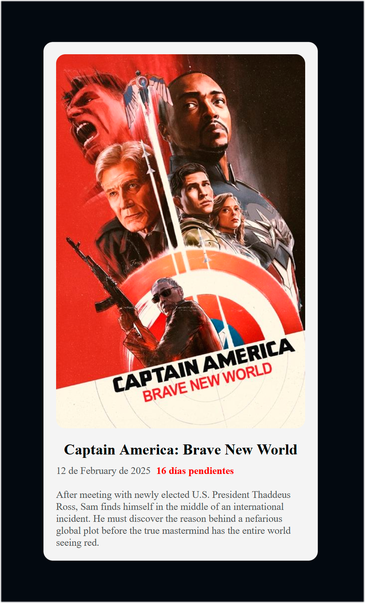

#### Proyecto: Movie Marvel API
#### Lenguaje: PHP
#### Autor: breativo

# Movie Marvel API
### **Descripción**

Este proyecto es una `aplicación web en PHP` que consume una API externa para mostrar información sobre la próxima película del Universo Cinematográfico de Marvel (MCU). La aplicación recupera datos como el título de la película, su fecha de estreno, el póster promocional, una descripción y los días restantes para el estreno. La interfaz es sencilla y está diseñada para proporcionar una experiencia visual clara y atractiva.
<div style="text-align: center;">
  
</div>

### **Requisitos previos**

- Tener instalado `PHP 8.1 o superior.`
- Asegurarse de que las `extensiones curl e intl` están habilitadas.
- Tener `acceso a internet` para conectar con la API externa.

### **Conexión a la API**

Este código inicializa una conexión cURL para obtener datos de la API externa:

````PHP
const API_URL = "https://whenisthenextmcufilm.com/api";
$ch = curl_init(API_URL);
curl_setopt($ch, CURLOPT_RETURNTRANSFER, true);
curl_setopt($ch, CURLOPT_SSL_VERIFYPEER, false);
curl_setopt($ch, CURLOPT_SSL_VERIFYHOST, false);
curl_setopt($ch, CURLOPT_FOLLOWLOCATION, true);
$result = curl_exec($ch);
if ($result === false) {
    echo "<p>Error al obtener los datos. Por favor, intenta más tarde.</p>";
    $data = [];
} else {
    $data = json_decode($result, true);
}
curl_close($ch);
````

### **Formateo de la fecha**

El formateo de la fecha se realiza utilizando IntlDateFormatter para mostrarla en formato español:

````PHP
if (isset($data["release_date"])) {
    $date = new DateTime($data["release_date"]);
    $fmt = new IntlDateFormatter(
        'es_ES',
        IntlDateFormatter::LONG,
        IntlDateFormatter::NONE
    );
    echo $fmt->format($date);
} else {
    echo "Fecha no disponible";
}
````

### **Iniciar el servidor**

Para probar la aplicación localmente, utiliza el comando:


````PHP
php -S localhost:8000
````

### **Capturas de pantalla**


### **URL del proyecto**

https://moviemarvelphp.zeabur.app/


## ¡Apóyame! 
#### Puedes apoyar mi trabajo haciendo "☆ Star" en el repositorio. ¡Gracias!


### En mi perfil de GitHub tienes más información

[](https://github.com/breativo)