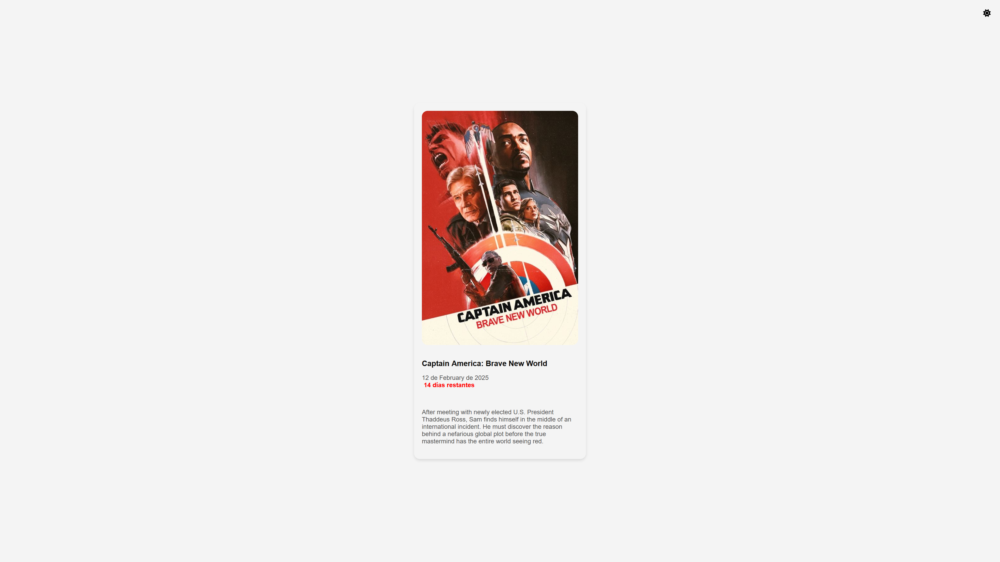
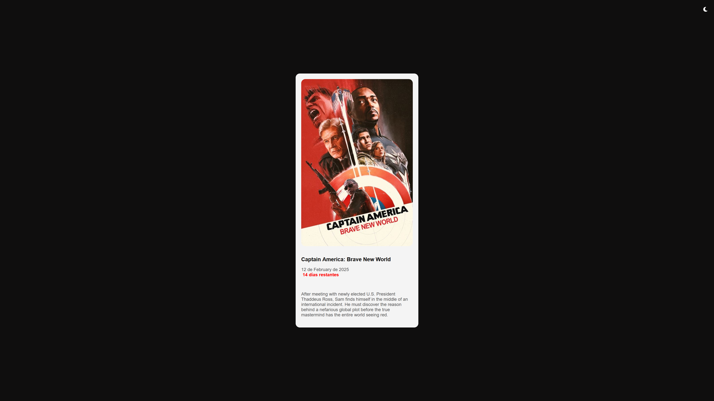

#### Proyecto: Movie Marvel API
#### Lenguaje: PHP
#### Autor: breativo

# Movie Marvel API


## **Descripción**

Este proyecto es una aplicación web en PHP que consume una API externa para mostrar información sobre la próxima película del Universo Cinematográfico de Marvel.

Se muestra:

- **Título de la película.**
- **Fecha de estreno** (formato español).
- **Póster promocional.**
- **Descripción breve de la película.**
- **Días restantes hasta el estreno.**
- **Modo oscuro y modo claro**, que se puede alternar con un botón.  

La interfaz es sencilla y amigable, con un diseño centrado en la accesibilidad.


## **Requisitos previos**

- Tener instalado `PHP 8.1 o superior.`
- Asegurarse de que las `extensiones curl e intl` están habilitadas.
- Tener `acceso a internet` para conectar con la API externa.

## **Conexión a la API**

Este código inicializa una **conexión cURL para obtener datos de la API externa**:

````PHP
class MovieAPI
{
    private const API_URL = "https://whenisthenextmcufilm.com/api";

    public static function fetchMovieData(): array
    {
        $ch = curl_init(self::API_URL);
        curl_setopt($ch, CURLOPT_RETURNTRANSFER, true);
        curl_setopt($ch, CURLOPT_SSL_VERIFYPEER, false);
        curl_setopt($ch, CURLOPT_SSL_VERIFYHOST, false);
        curl_setopt($ch, CURLOPT_FOLLOWLOCATION, true);

        $result = curl_exec($ch);
        curl_close($ch);

        return $result ? json_decode($result, true) : [];
    }
}
````

## **Formateo de la fecha**

El **formateo de la fecha** se realiza utilizando **IntlDateFormatter** para mostrarla en formato español:

````PHP
class DateFormatter
{
    public static function formatDate($date): string
    {
        $dateTime = new DateTime($date);
        $formatter = new IntlDateFormatter(
            'es_ES',
            IntlDateFormatter::LONG,
            IntlDateFormatter::NONE
        );

        return $formatter->format($dateTime);
    }
}

````

## **Iniciar el servidor**

Para probar la aplicación localmente, utiliza el comando:


````PHP
php -S localhost:8000
````

## **Capturas de pantalla**

<div style="text-align: center;">
  
</div>
</br>
<div style="text-align: center;">
  
</div>

## **URL del proyecto**

[URL del proyecto](https://moviemarvel.zeabur.app/)

## ¡Apóyame! 
#### Puedes apoyar mi trabajo haciendo "☆ Star" en el repositorio. ¡Gracias!


### En mi perfil de GitHub tienes más información

[](https://github.com/breativo)